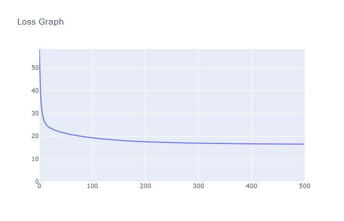

# MiniTorch Module 1

* Docs: https://minitorch.github.io/

* Overview: https://minitorch.github.io/module1.html

This assignment requires the following files from the previous assignments.

        minitorch/operators.py minitorch/module.py tests/test_module.py tests/test_operators.py project/run_manual.py

> It seems that the bare minitorch (without numpy acceleration, etc.) implemented by ourselves is much slower and has poorer performance than the real pytorch.

## Progress

- [x] task1_1

- [x] task1_2

- [x] task1_3

- [x] task1_4

- [x] task1_5

## Result

