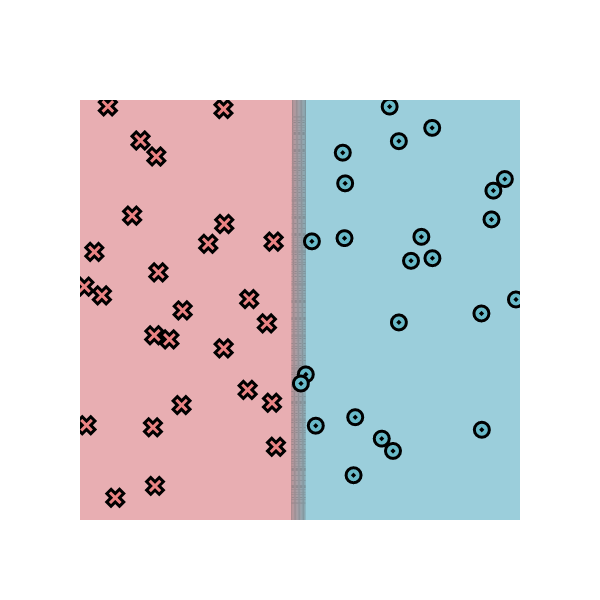
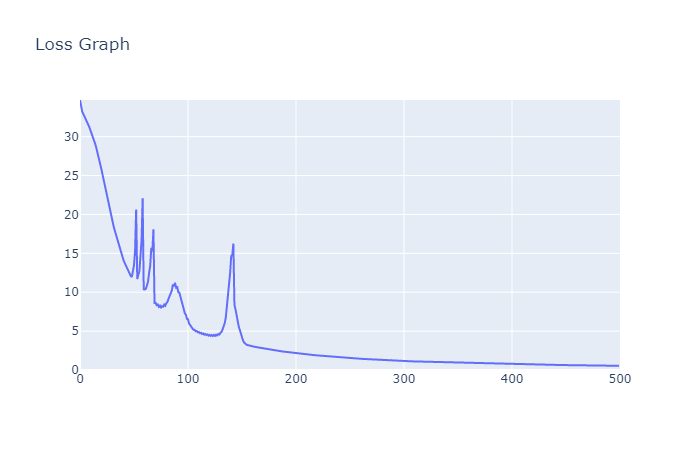

# MiniTorch Module 2

* Docs: https://minitorch.github.io/

* Overview: https://minitorch.github.io/module2.html

This assignment requires the following files from the previous assignments.

        minitorch/operators.py minitorch/module.py minitorch/autodiff.py minitorch/scalar.py minitorch/module.py project/run_manual.py project/run_scalar.py

> the result of minitorch with tensor has an enormous improvement compared to the bare minitorch. However, I believe the main reason is that in moudule-2, we are using global gradient descent instead of pure SGD in module-1.

## Progress

- [x] task2_1

- [x] task2_2

- [x] task2_3

- [x] task2_4

- [x] task2_5

## Result

