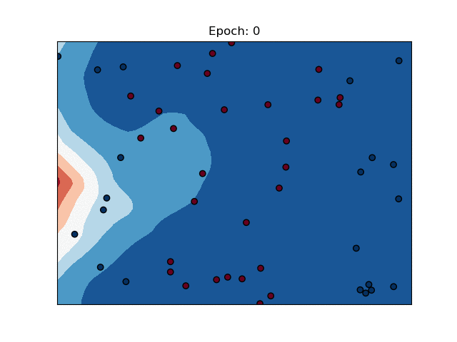
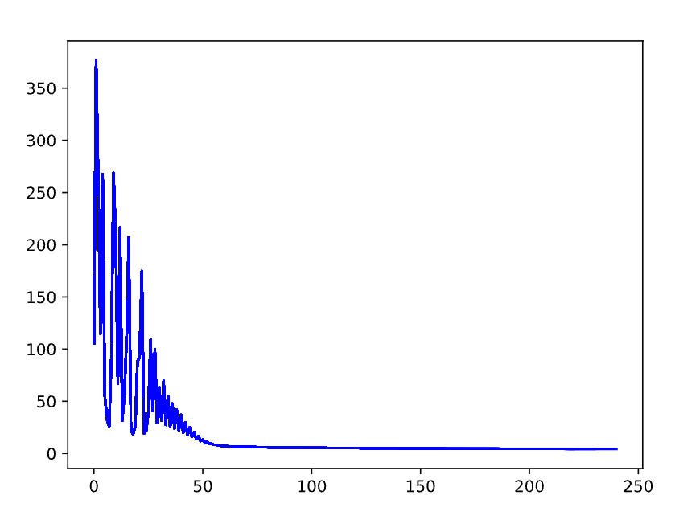
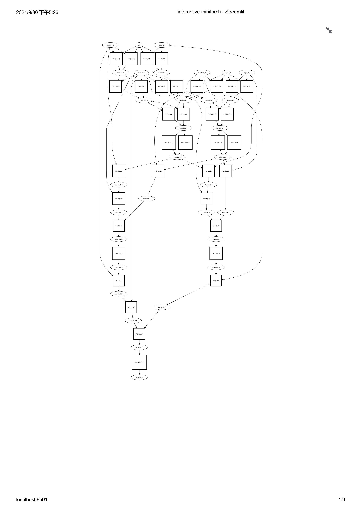

# MINI-TORCH

This is my implementation of mini-pytorch from scratch.

I followed tutorial in `Cornell CS5781: Machine Learning Engineering` to finish this project. 

Main features:

- tensor
    - tuple index
    - auto broadcast
    - reshape, view, permute
    - auto-diff and backpropagation
    - various operators and tensor functions
- nn
    - conv1d
    - conv2d
    - dropout
    - pooling
    - Linear
    - various nonlinear activations
    - module
    - parameter
- tensor ops
    - map
    - zip
    - reduce
- acceleration
    - cpu: fast ops-parallel computation
    - gpu: cuda ops

## SOME VISULAZATION

`1.train process`

`2.loss change`

`3.tensor graph`

